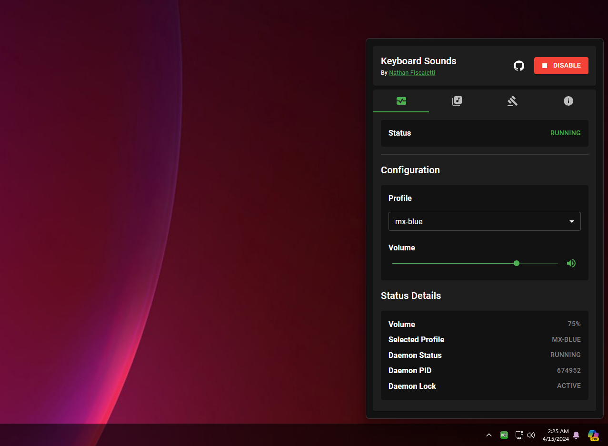

# Keyboard Sounds for Desktop

⚠️This project is a work-in-progress and is not yet ready for use.⚠️

This project is still in the very early stages of development. The goal is to create a desktop application as a front-end for the [Keyboard Sounds CLI Application](https://github.com/nathan-fiscaletti/keyboardsounds).



## Installation

Make sure you have [Keyboard Sounds](https://github.com/nathan-fiscaletti/keyboardsounds) installed before continuing.

Version 5.7.2 or later is required.

```powershell
PS> pip install keyboardsounds
PS> kbs --version
5.7.2
```

> Note: Currently only tested on windows.

[Download Windows Installer](https://github.com/nathan-fiscaletti/keyboardsounds-desktop/releases/latest/download/Keyboard%20Sounds.msi)
